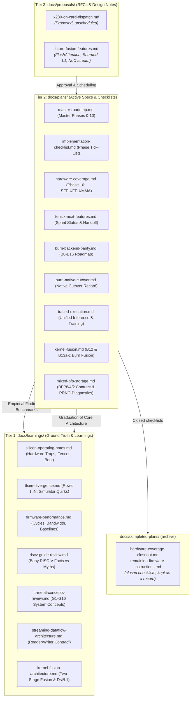

# Tenstorrent Blackhole Documentation & Architecture Knowledge Base

Welcome to the native Rust software stack documentation for Tenstorrent Blackhole (p100/p150a/p300).

Documentation in this repository is organized into a **3-tier lifecycle structure** (finished plans are then archived in `docs/completed-plans/`) to separate permanent empirical knowledge from active implementation plans and unscheduled feature proposals:

---

## The Three Tiers

### 1. `docs/learnings/` — Living Background & Empirical Source of Truth
Permanent, cumulative empirical realities discovered through silicon execution, hardware timing, and simulator testing.
- **Contract**: **Must be kept continuously up to date**. When new hardware behaviors, simulator divergences, or benchmark baselines are measured, record them here immediately.
- **Contents**:
  - [`silicon-operating-notes.md`](learnings/silicon-operating-notes.md): Critical hardware rules (ARC tile coordinate invariance, popcount harvesting, local RAM reset hazards, host crash prevention, power policy).
  - [`ttsim-divergence.md`](learnings/ttsim-divergence.md): Numbered catalog of every discrepancy between `ttsim`, the ISA spec, and real silicon.
  - [`firmware-performance.md`](learnings/firmware-performance.md): Hardware cycle counts, instruction execution latencies, DRAM bandwidth saturation, and icache measurements.
  - [`riscv-guide-review.md`](learnings/riscv-guide-review.md): Measured facts vs external misconceptions regarding baby RISC-V cores, caches, and memory maps.
  - [`tt-metal-concepts-review.md`](learnings/tt-metal-concepts-review.md): Architectural comparison of tt-metal concepts (G1–G16) vs this native Rust stack.
  - [`streaming-dataflow-architecture.md`](learnings/streaming-dataflow-architecture.md): The core architectural contract of the GDDR streaming scheduler (B reader on NoC0, T0–T2 compute, NC writer on NoC1, streaming credits, transfer channels).
  - [`kernel-fusion-architecture.md`](learnings/kernel-fusion-architecture.md): Architectural ground truth on two-stage kernel fusion (Burn IR vs. Tensix hardware), Dst register allocation, and L1 Circular Buffer streaming.

### 2. `docs/plans/` — Active Implementation Plans & Checklists
Actionable technical specifications, interface contracts, and execution checklists (`[ ]` / `[x]`) for active and long-running engineering milestones.
- **Contract**: Checked off as gates pass on simulator and silicon. Contains all information required to implement and verify features.
- **Contents**:
  - [`burn-op-coverage.md`](plans/burn-op-coverage.md): Generated (`cargo xtask burn-coverage`) status of every Burn operation-trait method: native, composed or explicitly unsupported with its `[-]` reason.
  - [`master-roadmap.md`](plans/master-roadmap.md): Master architectural roadmap spanning Phases 0–10.
  - [`implementation-checklist.md`](plans/implementation-checklist.md): Master tick-list tracking overall stack milestones across phases.
  - [`hardware-coverage.md`](plans/hardware-coverage.md): Phase 10 tracker for Tensix tile units (SFPU, FPU, Matrix Engine), numerical tolerance contracts, and Burn op coverage.
  - [`tensix-next-features.md`](plans/tensix-next-features.md): Current sprint handoff, native operation status, numerical contracts, and validation evidence.
  - [`burn-backend-parity.md`](plans/burn-backend-parity.md): B0–B16 roadmap for `burn-tt` to achieve full backend parity with CubeCL/CUDA.
  - [`burn-native-cutover.md`](plans/burn-native-cutover.md): Native cutover record, retired Flex fallback, delivered tensor storage and deferred formats.
  - [`mixed-bfp-storage.md`](plans/mixed-bfp-storage.md): Delivered BFP8/4/2 storage and training contract, acceptance checklist, PRNG diagnostics and remaining application RNG work.
  - [`traced-execution.md`](plans/traced-execution.md): Comprehensive implementation plan for generalized multi-input inference and whole training step hardware traces (`TracedInference`, `TracedTrainingStep`).
  - [`kernel-fusion.md`](plans/kernel-fusion.md): Actionable specification and execution checklist for Burn backend kernel fusion milestones B12 and B13a–B13c.

### 3. `docs/proposals/` — Feature Proposals & RFCs
Unscheduled design proposals and exploratory RFCs evaluating trade-offs before implementation.
- **Contract**: When approved and scheduled, a proposal graduates into an implementation plan in `docs/plans/` (or is incorporated into an existing plan) and is removed from proposals.
- **Contents**:
  - [`x280-on-card-dispatch.md`](proposals/x280-on-card-dispatch.md): RFC proposing use of on-card SiFive X280 RISC-V cores for on-card host orchestration.
  - [`future-fusion-features.md`](proposals/future-fusion-features.md): RFCs for advanced fusion: Tiled Online Softmax FlashAttention, sharded multi-core L1 mesh tensor residency, and inter-core NoC streaming.

### Completed plans: `docs/completed-plans/`
Plans whose checklists are closed move here as a record, with their evidence. They are not updated; current behaviour lives in `docs/learnings/` and the active plans. Examples: [`hardware-coverage-closeout.md`](completed-plans/hardware-coverage-closeout.md) (the Phase 10 close-out), [`remaining-firmware-instructions.md`](completed-plans/remaining-firmware-instructions.md), and the ADC copy, source-bank and scalar-movement plans.

---

## Codebase Subsystem $\leftrightarrow$ Documentation Matrix

Because core accelerator runtime features are cross-cutting (spanning firmware, kernels, and the Burn backend), use this matrix to identify all relevant plans and learnings for any crate in the repository:

| Crate / Layer | Primary Responsibility | Relevant Learnings (`docs/learnings/`) | Relevant Plans & Checklists (`docs/plans/`) |
| :--- | :--- | :--- | :--- |
| **`tt-isa`** | Encodings, registers, tile numerics, NoC protocols | [`ttsim-divergence.md`](learnings/ttsim-divergence.md) [`riscv-guide-review.md`](learnings/riscv-guide-review.md) | [`master-roadmap.md`](plans/master-roadmap.md) [`hardware-coverage.md`](plans/hardware-coverage.md) |
| **`tt-device` / `tt-kmd`** | Transport abstraction, ARC discovery, PCIe, reset/power | [`silicon-operating-notes.md`](learnings/silicon-operating-notes.md) [`ttsim-divergence.md`](learnings/ttsim-divergence.md) | [`master-roadmap.md`](plans/master-roadmap.md) [`implementation-checklist.md`](plans/implementation-checklist.md) |
| **`tt-layout`** | Tilize, detilize, format conversions | [`firmware-performance.md`](learnings/firmware-performance.md) | [`hardware-coverage.md`](plans/hardware-coverage.md) [`tensix-next-features.md`](plans/tensix-next-features.md) |
| **`tt-firmware`** | Baby RISC-V firmware (B, NC, T0–T2, E1) | [`firmware-performance.md`](learnings/firmware-performance.md) [`streaming-dataflow-architecture.md`](learnings/streaming-dataflow-architecture.md) [`silicon-operating-notes.md`](learnings/silicon-operating-notes.md) [`riscv-guide-review.md`](learnings/riscv-guide-review.md) | [`hardware-coverage.md`](plans/hardware-coverage.md) [`traced-execution.md`](plans/traced-execution.md) [`tensix-next-features.md`](plans/tensix-next-features.md) |
| **`tt-kernels`** | Program builders, `Session`, GDDR, L1, traces, mesh | [`streaming-dataflow-architecture.md`](learnings/streaming-dataflow-architecture.md) [`tt-metal-concepts-review.md`](learnings/tt-metal-concepts-review.md) | [`master-roadmap.md`](plans/master-roadmap.md) [`traced-execution.md`](plans/traced-execution.md) [`hardware-coverage.md`](plans/hardware-coverage.md) [`tensix-next-features.md`](plans/tensix-next-features.md) |
| **`burn-tt`** | Burn backend, tensor storage, server thread | [`tt-metal-concepts-review.md`](learnings/tt-metal-concepts-review.md) | [`burn-backend-parity.md`](plans/burn-backend-parity.md) [`burn-native-cutover.md`](plans/burn-native-cutover.md) [`traced-execution.md`](plans/traced-execution.md) [`tensix-next-features.md`](plans/tensix-next-features.md) |
| **`tt-tests` / `tt-mnist`**| E2E gates, simulator, models, golden regressions | [`ttsim-divergence.md`](learnings/ttsim-divergence.md) [`firmware-performance.md`](learnings/firmware-performance.md) | [`implementation-checklist.md`](plans/implementation-checklist.md) [`hardware-coverage.md`](plans/hardware-coverage.md) |
| **`xtask`** | Silicon test runner, code generators | [`silicon-operating-notes.md`](learnings/silicon-operating-notes.md) | [`master-roadmap.md`](plans/master-roadmap.md) [`burn-backend-parity.md`](plans/burn-backend-parity.md) |
