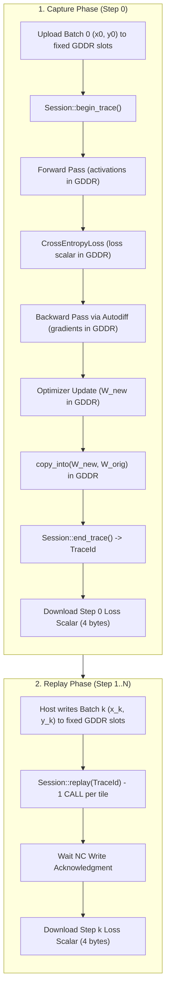

# Design & Implementation Plan: Traced Training Step for MNIST MLP & Transformer

## Goal Description

Currently, `burn_tt::Trace` (`crates/burn-tt/src/trace.rs`) only supports **inference traces** with a single float input and single float output. Training steps are executed in "fresh" untraced mode: every step requires host-side op construction, Autodiff graph node allocations, server thread dispatch, synchronization barriers, and individual command submissions.

As documented in [`docs/hardware-coverage.md:594`](hardware-coverage.md#L594):
> *"A training step is replayable once its weights are updated in place (the optimizer writing the same buffers) and the loss stays on the device; neither holds today (B16, and Burn's tensors are immutable). Until then a training loop traces its forward pass at most."*

Now that loss mean is resident on-card (Phase R1b) and streaming dataflow ownership is unified, this document details how to design and implement a **traced training step** for both:
1. **The Base MNIST Model (`Mlp<B>`)**: 784-128-10 MLP with ReLU, CrossEntropy, and SGD.
2. **The Transformer Model (`TinyTransformer<B>`)**: Embedding, Pre-LN TransformerEncoder (MHA + FFN), Linear head, CrossEntropy, and SGD.

A traced training step packages the forward pass, loss computation, backward pass, optimizer parameter updates, and parameter writeback into a single GDDR command stream. On replay, the host CPU only writes the new batch data and dispatches a single `CALL` entry per unit (`Session::replay`), dropping host per-step overhead to near zero.

---

## Technical Analysis: Architecture, Challenges, and Solutions

### 1. Parameter Immutability vs Static Replay Buffer Binding

- **The Problem**: A captured trace records hardware command streams where GDDR buffer addresses (channel and offset) are static. In Burn, modules and optimizers are functional: `model = optim.step(lr, model, grads)` allocates fresh `Param` tensors with newly allocated GDDR buffers. If a trace captured step 0, replaying it on step 1 would read the *original* weight buffers (which were never updated) and write to the same temporary buffers. The model parameters would never accumulate updates across training steps.
- **The Solution (In-Place Copy Back)**: At the end of the captured step, the updated parameter buffers are copied back into the original parameter buffers via an on-device transfer: `copy_into(src: new_param, dst: orig_param)`. Because this transfer is captured into the trace stream, every hardware replay automatically copies the updated weights into the original parameter buffers at the end of the step. The host's `model` struct continues pointing to these original buffers, meaning after $N$ replay steps, the model holds the fully trained weights in-place.

### 2. Loss Readback & Host Transfer Restrictions

- **The Problem**: `Session::begin_trace` enforces `refuse_while_capturing("download")` with `TraceError::HostTransfer`. In standard untraced training, calling `loss.into_scalar().elem::<f32>()` triggers a synchronous 4-byte download from GDDR to host mid-step.
- **The Solution**: Keep the loss scalar resident in GDDR during capture. The loss tensor is designated as the trace output. During capture, `into_scalar()` is avoided until after `end_trace()`. On each replay step, `s.replay(id)` runs, and only after completion is the 4-byte scalar loss downloaded to the host for logging.

### 3. Multi-Input Feeding (Batch Images / Tokens + Labels / Targets)

- **The Problem**: `burn_tt::Trace` only accepts a single `&TtTensor` input of F32 type. Training requires:
  - For MNIST MLP: `x` (`[64, 784]`, F32/BF16) and `y` (`[64]`, I32).
  - For Transformer: `x` (`[4, 32]`, I32) and `y` (`[128]`, I32).
- **The Solution**: Extend `Session` with `write_bits` (to support writing integer tensors) and introduce a multi-input training trace abstraction (`TrainingTrace`) that manages writing batches into fixed input GDDR slots before each replay.

### 4. Transformer Model: Dynamic Tokens vs Embedding Gather

- **The Problem**: In `burn-tt`, `CrossEntropyLoss` already uses `index_mask` and `MASK_WHERE`, which dynamically evaluate changed target indices on-device via SFPU. However, `burn::nn::Embedding` uses `float_select` (`gather_rows`) and `float_select_add` (`rows_add`), which compile specific row indices into the mover command stream. Replaying this statically would keep reading and updating the rows corresponding to step 0's tokens.
- **The Solution**: For the Transformer model, two viable paths:
  - **Option A (One-Hot GEMM)**: Express embedding lookup as a one-hot matrix multiplication: $X_{\text{one\_hot}} \times W_{\text{embed}}$, where $X_{\text{one\_hot}} \in \mathbb{R}^{128 \times 64}$ and $W_{\text{embed}} \in \mathbb{R}^{64 \times 64}$. Both forward and backward passes are standard 2D GEMMs that operate dynamically on whatever tokens are written into the input buffer.
  - **Option B (Encoder + Head Trace)**: Trace the heavy computation layers (`TransformerEncoder` + `Linear` head + `CrossEntropyLoss` + backward + optimizer updates), while feeding embedding activations from the host/pre-step.

---

## Dataflow Diagram



---

## Proposed Changes by Component

### Component 1: `tt-kernels` (Core Tensor & Session Runtime)

#### [MODIFY] `crates/tt-kernels/src/tensor.rs`
- Implement `pub fn copy_into(src: &DramTensor, dst: &DramTensor, units: usize) -> Result<Work>`:
  - Validates dimension, grid shape, and element type parity between `src` and `dst`.
  - Reuses `dst.tensor_ref()` as the destination `ro` without allocating a new `DramTensor` from `DramAlloc`.
  - Emits `record::READ_RUN` from `src` and `record::WRITE_RUN` to `dst`.

```rust
pub fn copy_into(src: &DramTensor, dst: &DramTensor, units: usize) -> Result<Work> {
    const GROUP: usize = 128;
    if (src.rows, src.cols, src.elem) != (dst.rows, dst.cols, dst.elem) {
        return Err(TensorError::Shape(format!(
            "copy_into mismatched: src [{}, {}] {:?}, dst [{}, {}] {:?}",
            src.rows, src.cols, src.elem, dst.rows, dst.cols, dst.elem
        )));
    }
    let stage = staging("copy slots", GROUP)?;
    let [rt, ct] = src.grid();
    let (rs, ro) = (src.tensor_ref(), dst.tensor_ref());
    let jobs = runs(rt * ct, units, GROUP)
        .into_iter()
        .map(|run| {
            let (first, count) = (run.start as u32, run.len() as u32);
            vec![Step::Transfer {
                what: "copy_into list",
                depth: 1,
                batches: vec![TransferBatch {
                    read: vec![
                        [record::READ_RUN, first, count, stage as u32, 0, ct as u32, 0, 0],
                        rs.encode()[0],
                        rs.encode()[1],
                    ],
                    write: vec![
                        [record::WRITE_RUN, first, count, stage as u32, 0, 0, 0, 0],
                        ro.encode()[0],
                        ro.encode()[1],
                    ],
                }],
            }]
        })
        .collect();
    Ok(Work { out: dst.clone(), jobs })
}
```

#### [MODIFY] `crates/tt-kernels/src/session.rs`
- Implement `pub fn copy_into(&mut self, src: &DramTensor, dst: &DramTensor) -> Result<(), TensorError>`:
  - Invokes `tensor::copy_into` and submits via `self.submit_jobs(jobs, RESET_BUDGET)`.
- Implement `pub fn write_bits(&mut self, t: &DramTensor, values: &[u32]) -> Result<(), TensorError>`:
  - Exposes integer/bit writing into an existing `DramTensor` between trace replays (e.g. for label and token batches).

---

### Component 2: `burn-tt` (Device Server & Training Trace)

#### [MODIFY] `crates/burn-tt/src/server.rs`
- Expose `copy_into` in the device server:
  - `pub fn copy_into<T: Transport>(&mut self, s: &mut Session<T>, src: BufferId, dst: BufferId) -> Result<(), EngineError>`
- Expose `write_bits` in the device server:
  - `pub fn write_bits<T: Transport>(&mut self, s: &mut Session<T>, id: BufferId, bits: &[u32]) -> Result<(), EngineError>`
- Add `run_training_trace`:
  - Takes `trace: u64`, a list of input buffer updates, and `loss: BufferId`.
  - Performs host writes into the specified input buffers.
  - Calls `s.replay(id)` and waits for completion.
  - Downloads the 4-byte scalar loss.

#### [NEW] `crates/burn-tt/src/training_trace.rs`
- Provide `TrainingTrace`:
```rust
pub struct TrainingTrace {
    device: TtDevice,
    id: u64,
    inputs: Vec<BufferId>,
    loss: BufferId,
    _held: Vec<TtTensor>,
}

pub struct StepTiming {
    pub write_inputs: Duration,
    pub replay: Duration,
    pub read_loss: Duration,
    pub loss: f32,
}

impl TrainingTrace {
    pub fn capture(
        device: TtDevice,
        inputs: &[&TtTensor],
        step_fn: impl FnOnce() -> (TtTensor, Vec<(TtTensor, TtTensor)>),
    ) -> Result<(Self, f32), EngineError>;

    pub fn step(&self, inputs: &[InputPayload]) -> Result<StepTiming, EngineError>;
}
```

---

### Component 3: `tt-mnist` (Workload Integration & Benchmark)

#### [MODIFY] `crates/tt-mnist/src/main.rs`
- Add `--train-trace` CLI argument to `Args`.
- Implement `train_traced(...)` for MNIST MLP:
  - Prepares input image tensor `x_batch` and label tensor `y_batch`.
  - Captures batch 0:
    ```rust
    let (trace, first_loss) = TrainingTrace::capture(device, &[&x_batch, &y_batch], || {
        let logits = model.forward(x_batch.clone());
        let loss = loss_fn.forward(logits, y_batch.clone());
        let grads = GradientsParams::from_grads(loss.clone().backward(), &model);
        let new_model = optim.step(LR, model.clone(), grads);
        let updates = collect_param_pairs(&new_model, &model);
        (loss, updates)
    })?;
    ```
  - Replays steps 1 to $S$:
    - Writes `images[from..from+BATCH]` into `x_batch` and `labels[from..from+BATCH]` into `y_batch`.
    - Calls `trace.step(...)`.
    - Reports steady-state timing breakdown (PCIe write, on-device replay, loss read).
  - Evaluates `model.valid()` against the test set to verify test accuracy matches untraced (~92%).

#### [MODIFY] `crates/tt-mnist/src/transformer.rs`
- Implement `train_traced(...)` for `TinyTransformer`:
  - Utilizes One-Hot Matmul for embedding projection or traces encoder + head.
  - Verifies that cross-entropy loss with dynamic targets converges bit-for-bit with untraced training.

---

## Verification Plan

### Automated Tests
1. **Unit test in `tt-kernels`**:
   `cargo test -p tt-kernels --lib copy_into`
   - Verifies `copy_into` correctly moves data between two allocated DRAM tensors and matches golden buffers bit-for-bit.
2. **Burn training trace test in `tt-tests`**:
   `cargo test -p tt-tests --test step40_burn_trace`
   - Tests parameter updates across multiple replays and verifies loss monotonically decreases on synthetic regression.
3. **End-to-End MNIST training test**:
   `cargo test -p tt-tests --features e2e --test step12_mnist`
   - Confirms golden numerical bounds and deterministic behavior.
4. **Silicon verification**:
   `cargo xtask silicon --release --device 0 --filter step40`
   `cargo run --release -p tt-mnist -- --steps 50 --train-trace`
   `cargo run --release -p tt-mnist -- --model transformer --steps 10 --train-trace`

### Manual Verification
- Inspect timing breakdown:
  Verify on-device replay time per step decreases by ~0.2–0.4 ms compared to untraced mode due to zero host op construction and zero server thread scheduling overhead.
- Inspect test accuracy after 1 full epoch on MNIST to verify final weights are correctly written back in-place.
