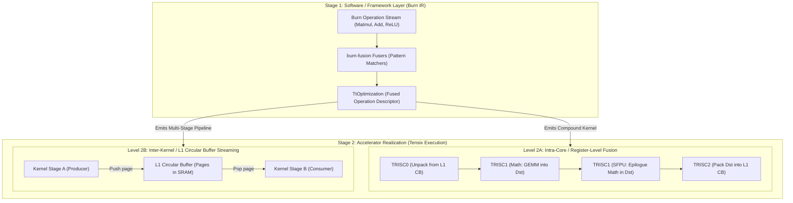
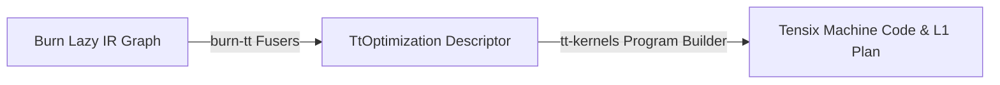

# Tenstorrent Kernel Fusion: Architectural Ground Truth

This document establishes the permanent empirical and architectural principles of **Kernel Fusion** for Tenstorrent Blackhole accelerators within the `metalium-rs` stack. It details how the software-level graph representation in Burn interfaces with the physical micro-architecture of Tensix cores, and why our direct Rust compilation model eliminates the multi-tier compiler bloat seen in traditional accelerator stacks.

---

## 1. The Two-Stage Fusion Model

Accelerating deep learning operations through fusion requires distinguishing between **Graph-Level Pattern Matching (Software IR)** and **Hardware-Level Resource Scheduling (Tensix Execution)**.



### Stage 1: Software Level (Burn Graph IR)
Burn's role is **graph capture and identification of fusible patterns**:
- Burn tracks operations lazily in an abstract syntax DAG (e.g., `float_matmul` followed by `float_add` followed by `relu`).
- The Burn fusion client buffers operations and presents them to backend-registered `OperationFuser` instances.
- **Burn does NOT compile machine instructions or manage hardware registers.** It evaluates whether operations are mathematically compatible, tracks tensor handle lifetimes, and emits a structured optimization request (e.g., `TtOptimization::MatmulEpilogue`).

### Stage 2: Hardware Level (Tensix Execution on Blackhole)
Tenstorrent's role is **eliminating memory hierarchy traversals**:
Accessing memory on Blackhole exhibits extreme disparities in latency, bandwidth, and energy:
- **`Dst` Register / SFPU LRegs**: 0–1 cycle latency, internal to compute datapath.
- **L1 SRAM (1.5 MB per Tensix core)**: Single-digit cycle latency, multi-terabyte/sec aggregate bandwidth across the 2D mesh.
- **GDDR7 (DRAM)**: Hundreds of cycles latency, strictly bandwidth-limited (~tens of GB/s per channel).

Hardware-level fusion operates across two physical boundaries:
1. **Intra-Kernel / Register-Level Fusion**:
   - Operations execute *within a single Tensix execution pass*.
   - Intermediate values never touch L1 SRAM or GDDR; they reside in the **`Dst` registers** or SFPU register file.
   - Example: A GEMM accumulates into `Dst`. Before TRISC2 packs `Dst` to memory, TRISC1 executes SFPU math (vector add, GELU, SiLU) directly on `Dst`.
2. **Inter-Kernel / L1 Residency Fusion**:
   - Operations execute as *distinct program stages* or kernels.
   - Intermediate activations are preserved in **L1 SRAM** via Circular Buffers (CBs) or sharded L1 memory.
   - The NoC writes to GDDR (`NC` writer) and NoC reads from GDDR (`B` reader) are completely bypassed.

---

## 2. Tensix Hardware Execution Realities

Each Tenstorrent Blackhole Tensix tile is a heterogeneous, five-core processing cluster:
- **BRISC (RISC-V B)**: Data mover responsible for NoC0 inbound reads from GDDR/PCIe into L1.
- **NCRISC (RISC-V NC)**: Data mover responsible for NoC1 outbound writes from L1 to GDDR/PCIe.
- **TRISC0 (Unpack)**: Unpacks data from L1 Circular Buffers into the `SrcA` and `SrcB` register banks.
- **TRISC1 (Math & SFPU)**: Executes matrix products into the `Dst` register and evaluates vector math via the Special Function Processing Unit (SFPU).
- **TRISC2 (Pack)**: Formats, rounds, and packs datums from the `Dst` register back into output L1 Circular Buffers.

### The 512-Row `Dst` Register Allocation
On Blackhole, the 32-bit `Dst` register space contains 512 rows of 64 bytes (half-tile faces). In `tt-kernels` (`sfpu/kernel.rs`), rows are partitioned with strict hardware contracts:

| Row Range | Designated Purpose | Hardware Owner |
| :--- | :--- | :--- |
| `0 .. 64` (`A_ROW`) | First operand ($A$) | TRISC0 Unpacker writes; TRISC1 Math/SFPU reads |
| `64 .. 128` (`B_ROW`) | Second operand ($B$) / Row Broadcast | TRISC0 Unpacker writes; TRISC1 Math/SFPU reads |
| `128 .. 192` (`OUT_ROW`) | Execution result | TRISC1 Math/SFPU writes; TRISC2 Packer reads |
| `192 .. 256` (`C_ROW`) | Third operand ($C$) (Ternary / Bias) | TRISC0 Unpacker writes; TRISC1 SFPU reads |
| `256 .. 512` (`SPILL_ROW`) | Register spill area (`log1p`, `pow`, etc.) | TRISC1 SFPU internal scratch; untouched by Unpack/Pack |

### Zero-Cost Epilogues in `Dst`
When executing a standard Matrix Multiplication:
1. TRISC0 unpacks tiles of $A$ and $B$ into `SrcA` and `SrcB`.
2. TRISC1 Math issues matrix multiply instructions, accumulating the product directly into `Dst` rows `0..64` (or `128..192`).
3. In an **unfused** execution: TRISC2 immediately packs `Dst` to an L1 buffer, and NCRISC writes it over NoC1 to GDDR. A subsequent Bias-Add kernel must read it from GDDR on NoC0, unpack to `Dst`, add, and pack back to GDDR.
4. In a **fused** execution:
   - Before TRISC2 initiates packing, TRISC1 switches to SFPU mode.
   - TRISC0 unpacks the bias row into `B_ROW` / `C_ROW`.
   - TRISC1 SFPU evaluates the vector addition and activation function (e.g. ReLU, GELU) directly on the contents of `Dst`.
   - TRISC2 packs the finalized result out of `Dst` once.
   - **GDDR traffic saved**: 2 full tensor writes and 2 full tensor reads eliminated per linear layer.

---

## 3. L1 SRAM Budget and Circular Buffer Streaming

### The 1.5 MB L1 SRAM Budget
Blackhole provides 1.5 MB of L1 SRAM per Tensix core. It is statically partitioned:
- **Firmware & Stack**: ~200–300 KB reserved for RISC-V B/NC/T0–T2 binaries, stack, mailboxes, and hardware profiling structures (`tt_isa::l1`).
- **Data Arena (`tt_isa::l1::DATA`)**: ~1.2 MB available for Circular Buffers and staging tiles.

Whole activation tensors in modern models (e.g., $1024 \times 1024$ FP32 = 4 MB) cannot fit in a single core's 1.2 MB data arena. Therefore, inter-kernel fusion on Tensix must operate via **tiled streaming** rather than full-tensor materialization.

### Circular Buffer Fusion via `Requirements::fuse`
In `metalium-rs`, memory is never allocated as raw, unmanaged addresses. Kernels declare [`Requirements`](file:///mnt/nvme/metalium-rs/crates/tt-kernels/src/l1.rs):
- Buffers specify `bytes`, `align`, and a liveness interval `live: Range<u32>` across kernel execution stages.
- Circular buffers are declared with a `page` size, `pages` count, a `producer` endpoint, and a `consumer` endpoint.

[`Requirements::fuse`](file:///mnt/nvme/metalium-rs/crates/tt-kernels/src/l1.rs#L240-L340) provides compile-time fusion:
```rust
pub fn fuse(
    first: &Requirements,
    second: &Requirements,
    edges: &[(Buf, Buf)],
) -> Result<Fused, PlanError>
```
1. **Concatenates Stages**: The stages of `second` are shifted to follow `first`.
2. **Unifies Circular Buffers**: For each `(out, input)` edge in `edges`:
   - `out`'s producer and `input`'s consumer are connected into a single circular buffer.
   - The buffer's lifetime is extended from `first`'s start to `second`'s end.
   - **Eliminates GDDR legs**: The GDDR write leg of `first` (NC writer) and the GDDR read leg of `second` (B reader) are dropped entirely.
3. **Guarantees L1 Capacity**: The fused requirement is planned as one unified allocation. If the combined footprint exceeds the 1.2 MB L1 arena, planning fails deterministically at build time with `PlanError::OutOfMemory`, preventing runtime corruption or silent memory overlaps.

---

## 4. Why We Do Not Need a Second Graph Compiler

In the broader AI compiler landscape, stacks often involve 3–4 translation layers:
$$\text{PyTorch} \xrightarrow{\text{FX / Dynamo}} \text{TorchInductor} \xrightarrow{\text{Dialect}} \text{MLIR / TT-Forge} \xrightarrow{\text{C++ Emitter}} \text{TT-Metalium C++} \xrightarrow{\text{LLK}} \text{Tensix Binary}$$

This introduces severe drawbacks:
- Multi-second compilation latency.
- High memory footprint from multiple intermediate representations.
- Brittle Python-to-C++ FFI boundaries and opaque debuggability.

### The Native Rust Model in `metalium-rs`
In our stack, **Burn's `burn-fusion` serves as the sole graph-level pattern matcher**:



1. **No Intermediate Dialects**: Burn's IR directly captures the math DAG.
2. **Direct Hardware Translation**: The `burn-tt` fusers (`ElementWiseFuser`, `MatmulEpilogueFuser`) emit typed Rust descriptors that directly invoke `tt-kernels` program builders.
3. **Microsecond JIT Overhead**: Compiling a fused program and computing its L1 plan takes microseconds, not seconds.
4. **End-to-End Type Safety**: Rust's type system guarantees buffer alignment, register allocation validity, and lifetime bounds across the entire pipeline.

---

## 5. Comparison: `metalium-rs` vs. TT-Metalium (`tt-metal` / `ttnn`)

| Feature | TT-Metalium (`tt-metal` / `ttnn`) | Native Rust (`metalium-rs`) |
| :--- | :--- | :--- |
| **Fusion Mechanism** | Hand-written C++ kernels and LLK template specializations (e.g. `bmm_op` variants) | Dynamic greedy pattern matching via Burn `OperationFuser` + composable Tensix micro-kernels |
| **L1 Residency Control** | Manual `MemoryConfig(L1)` specified by the user or Python framework | Automatic via Burn tensor lifetimes + `Requirements::fuse` Circular Buffers |
| **L1 Memory Safety** | Runtime `OutOfMemoryError` or silent core hangs if allocations collide | Checked at plan construction; deterministic build-time `PlanError` |
| **Epilogue Execution** | Fixed C++ macro sequences in LLK compute thread | Parameterized SFPU instruction sequences evaluated directly on `Dst` |
| **Language Boundary** | Python $\to$ C++ $\to$ LLK C++ $\to$ Clang / GCC RISC-V | 100% Native Rust (`burn-tt` $\to$ `tt-kernels` $\to$ `tt-isa`) |
