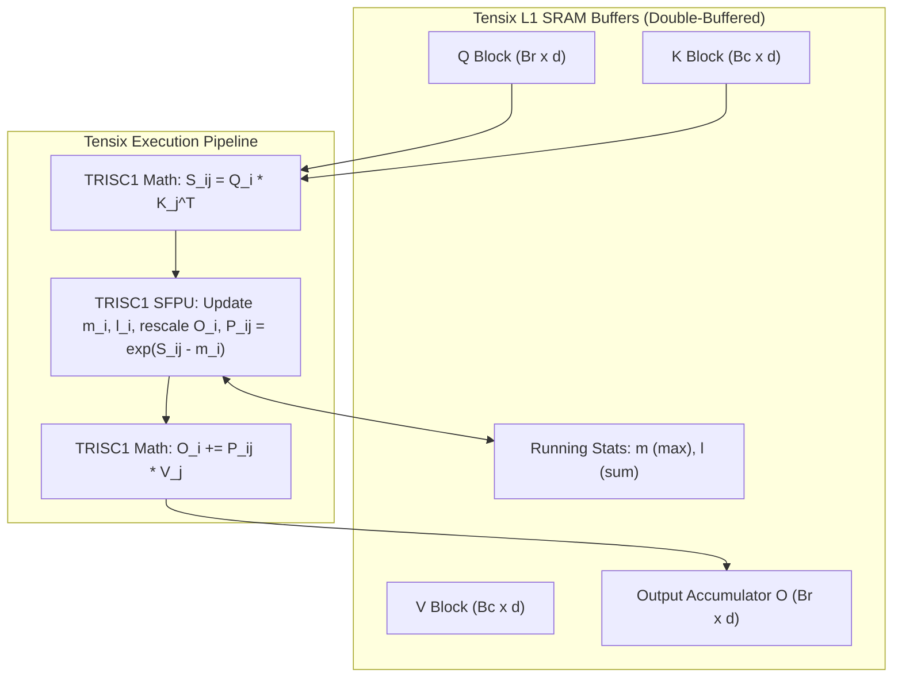
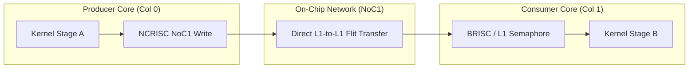

# RFC: Advanced Kernel Fusion & L1 Dataflow Proposals

This document collects architectural proposals and Requests for Comments (RFCs) for future fusion and dataflow capabilities in `metalium-rs`, extending beyond the initial Burn B12/B13 milestones.

---

## Proposal 1: Tiled Online Softmax FlashAttention (Tensix L1 SRAM)

### Problem Statement
Standard multi-head attention computes:
$$\text{Attention}(Q, K, V) = \text{Softmax}\left(\frac{Q K^T}{\sqrt{d_k}}\right) V$$
In an unfused implementation, materializing the attention score matrix $S = Q K^T$ requires $O(S^2)$ GDDR storage per head. For sequence length $S = 2048$ with FP32 or BF16, this creates severe memory bandwidth bottlenecks and limits maximum context length.

Because attention scores are immediately consumed by the subsequent reduction and multiplication by $V$, materializing $S$ in GDDR is completely unnecessary if intermediate scores can be accumulated within Tensix L1 SRAM.

### Technical Design: FlashAttention on Tensix
Using the online softmax formulation (Dao et al., Milakov & Gimelshein):



1. **L1 Tiling**:
   - Tile query sequence into blocks of size $B_r \times d$ (e.g., $64 \times 64$).
   - Tile key/value sequence into blocks of size $B_c \times d$ (e.g., $64 \times 64$).
   - Total L1 buffer requirement: $4 \times (64 \times 64 \times 2\text{ bytes}) \approx 32\text{ KB}$, easily fitting in the 1.2 MB L1 data arena.
2. **Online Softmax Loop in Tensix**:
   - For each $K_j, V_j$ block loaded from GDDR:
     1. TRISC1 computes $S_{ij} = Q_i K_j^T / \sqrt{d}$ into `Dst`.
     2. TRISC1 SFPU calculates new row-max $m_i^{\text{new}} = \max(m_i, \text{rowmax}(S_{ij}))$.
     3. Rescales previous accumulator $O_i \leftarrow O_i \cdot e^{m_i - m_i^{\text{new}}}$.
     4. Computes $P_{ij} = e^{S_{ij} - m_i^{\text{new}}}$ and updates running sum $l_i$.
     5. TRISC1 computes $O_i \leftarrow O_i + P_{ij} V_j$.
   - Final normalization: TRISC1 SFPU multiplies $O_i$ by $1 / l_i$ before TRISC2 packs to GDDR.
3. **Burn Integration**:
   - Burn's attention module or a custom `AttentionFuser` detects the scaled dot-product attention pattern and dispatches `TtOptimization::FlashAttention`.

---

## Proposal 2: Sharded Multi-Core L1 Tensor Residency

### Problem Statement
In deep models, sequential operations frequently produce activations that are immediately consumed by the next operation (e.g., LayerNorm $\to$ Matmul $\to$ Residual Add).
While a single Tensix core only has 1.2 MB of usable L1 SRAM, a full Blackhole grid contains **64 to 100 Tensix cores**, providing **75 to 120 MB of aggregate on-chip SRAM**.

By distributing activations across the core grid, medium-sized intermediate tensors can remain completely on-chip across kernel dispatches.

### Technical Design: Mesh L1 Residency
1. **Sharded Tensor Descriptor**:
   ```rust
   pub enum Residency {
       Dram(DramBuffer),
       L1Sharded {
           range: CoreRangeSet,
           shard_shape: [usize; 2],
           l1_address: u32,
           generation: u64,
       },
   }
   ```
2. **Mesh L1 Allocator in `burn-tt`**:
   - Statically banks the 1.2 MB data arena across the designated worker cores.
   - Allocates sharded chunks with aligned bank offsets.
   - Tracks live handles referencing L1 allocations.
3. **Automatic GDDR Spill Policy**:
   - When an allocation would exceed available L1 mesh capacity:
   - Evaluates a Least-Recently-Used (LRU) eviction policy.
   - Issues asynchronous DMA copies via NCRISC to spill older activations to GDDR.
   - Downstream kernels needing spilled tensors dynamically fall back to reading from GDDR.

---

## Proposal 3: Inter-Core NoC Pipeline Streaming

### Problem Statement
When two operations cannot be fused inside a single core (e.g., operation A requires full row reductions while operation B requires column operations), running them sequentially still incurs kernel launch and synchronization latency.

Instead of running Stage A to completion, writing to memory, and then launching Stage B, cores can form a **spatial pipeline across the NoC**.

### Technical Design: Spatial Dataflow Across Cores



1. **Direct L1-to-L1 NoC Transfers**:
   - Core A's NCRISC writes directly into Core B's L1 Circular Buffer using NoC1 unicast or multicast.
   - GDDR is never touched.
2. **Hardware L1 Semaphores**:
   - Core B signals credits to Core A using NoC atomic semaphore increments.
   - Core A checks available space in Core B's remote CB before transmitting.
   - Core A increments Core B's arrival semaphore upon completing the transfer.
3. **Integration with `Requirements::fuse`**:
   - Extend `Endpoint` in [`tt_kernels::l1`](file:///mnt/nvme/metalium-rs/crates/tt-kernels/src/l1.rs#L38) to include `RemoteEndpoint { core: TranslatedCoord, endpoint: Endpoint }`.
   - The L1 planner generates paired synchronization structures on both tiles.
